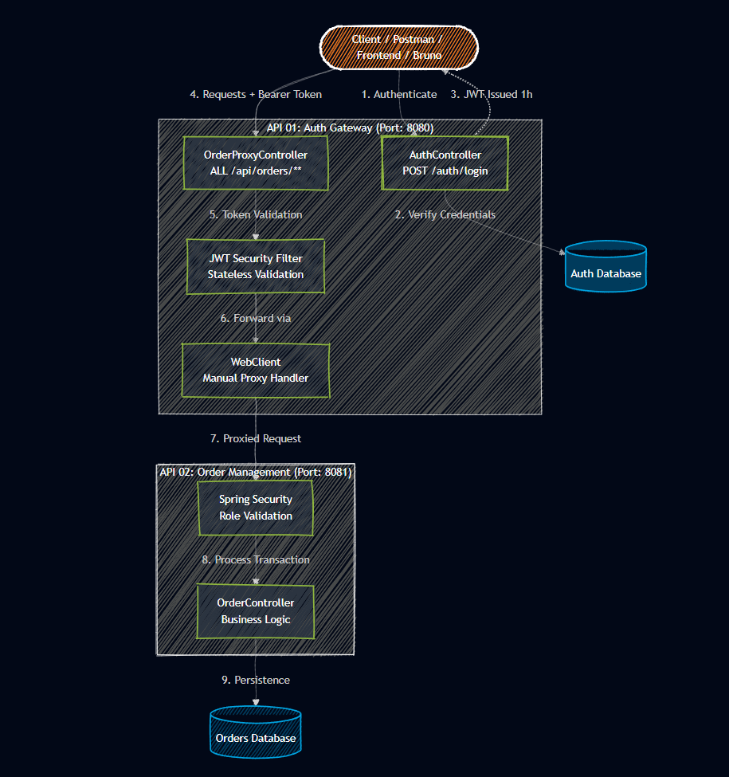

# Distributed Order Orchestrator (DOO)


## 🚀 Overview

This project implements a robust, distributed architecture for an Order Management System, built with **Java 21** and **Spring Boot 4**. It adopts a microservices approach, utilizing an Auth Gateway pattern to handle security at the edge. 

A high-performance, distributed ecosystem designed for secure order management. This project features a robust **API Gateway** using a manual **WebClient** proxy pattern to ensure centralized authentication and seamless service orchestration.

Key architectural highlights include:
* **Zero-Trust Edge Security:** Stateless JWT authentication and manual proxy routing via Spring WebFlux `WebClient`.
* **Modern Persistence:** Powered by **PostgreSQL 17**, utilizing time-ordered `UUID v7` for optimal B-Tree index performance and anti-fragmentation.
* **Automated Image Publish:** Pipeline orchestrated with GitHub Actions for testing and publish JVM images.

---

- Javadoc + TestReports + Coverage Tests Reports: https://vitorhugo-java.github.io/distributed-gateway-order-system/

---

## System Architecture

The system is architected as a set of decoupled microservices that communicate over a private network, ensuring data integrity and security.



---

## Getting Started

This project is fully containerized for a one-click deployment experience.

### Prerequisites

- Docker and Docker Compose
- Java 21 (for local development)

### Deployment

1. Clone the repository:
```bash
git clone https://github.com/your-user/distributed-order-orchestrator.git
cd distributed-order-orchestrator
```

2. Start the full stack:
```bash
docker-compose up --build
```

3. Access the services:
- Gateway (Entry Point): http://localhost:8080
- Direct Orders API: http://localhost:8081 (internal use recommended)
- Database: localhost:5432

---

## Technology Stack

- Core: Java 21, Spring Boot 4.0.6
- Security: Spring Security, JWT (JSON Web Token)
- Networking: Spring WebFlux (WebClient) for reactive proxying
- Persistence: Spring Data JPA, Hibernate 7, Flyway Migrations
- Databases: PostgreSQL (Production), H2 (Tests)
- DevOps: Docker, multi-stage Dockerfiles, Docker Compose
- Documentation: SpringDoc OpenAPI (Swagger UI)

---

## Security Overview

We implement stateless authentication using JWT.

1. Login: POST /auth/login returns a token
2. Authorization: Use Authorization: Bearer <token>
3. Validation: Gateway validates signature and expiration (1h)

---

## API Reference

### Auth Gateway (8080)

- POST /auth/login
- ANY /api/orders/**

### Order Management (8081)

- GET /api/orders
- POST /api/orders
- GET /api/orders/{id}
- DELETE /api/orders/{id}

---

## Requests Exemples

---

## Testing Credentials

- Username: admin
- Password: admin123

---

## Architectural Decisions

- Manual Proxying (instead of use Spring Cloud Gateway): WebClient used for fine-grained control over headers and error handling
- Database per Service: isolated databases to enforce shared-nothing architecture
- Multi-Stage Build: optimized Docker images with reduced size and attack surface
- JWT for Stateless Auth: eliminates session management and scales horizontally without sticky sessions
- UUID v7 for IDs orders-crud: time-ordered, optimized for B-Tree indexes in PostgreSQL, reduces fragmentation and avoid lock. The cons for using UUID is that it use more storage space than a traditional auto-incrementing integer, and use a little more CPU (~30–45 ns) than integer autoincrement, and it can be less performant for certain queries due to its larger size. However, the benefits of global uniqueness and reduced fragmentation often outweigh these drawbacks in distributed systems.

---

## Pipelines GitHub Actions
- **Qodana**: Static code analysis to ensure code quality and maintainability.
- **images-multi-module.yml**: Build and publish JVM images to GitHub Container Registry (GHCR) for all microservices.
- **deploy-docs.yml**: Deploy Docs and Coverage Reports to GitHub Pages.
